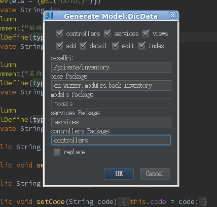

# nutzwk-plugin

nutzwk的idea intellij 的MVC代码生成插件

## 使用方法

### 下载安装插件

[github下载](nutzwk-plugin.jar)

### 依赖[nutzwk-code-generator](https://github.com/enilu/nutzwk-code-generator)

- 下载nutzwk-code-generator项目
- 安装nutzwk-code-generator到本地仓库
        cd nutzwk-code-generator
        mvn install
- 拷贝项目中的code/code.json配置文件到自己的项目中的resources目录下

### 用法

- 打开要生成model类，在代码中右键打开“Generate...”，选择“nutzwk mvc”
- 在弹出窗口选择“ok”按钮即可，即可在相应位置生成代码

**注意**

- 没错，这个插件，其实就是给nutzwk-code-generator增加个配置界面而已^_^
- 需要依赖最新版的nutzwk-code-generator项目
